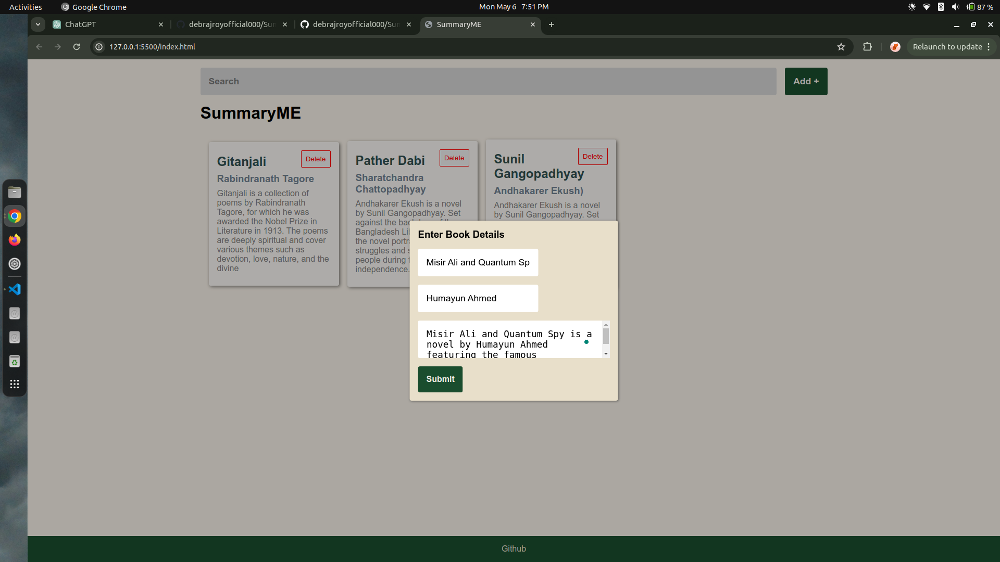
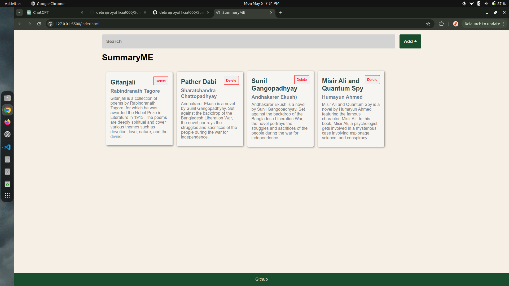
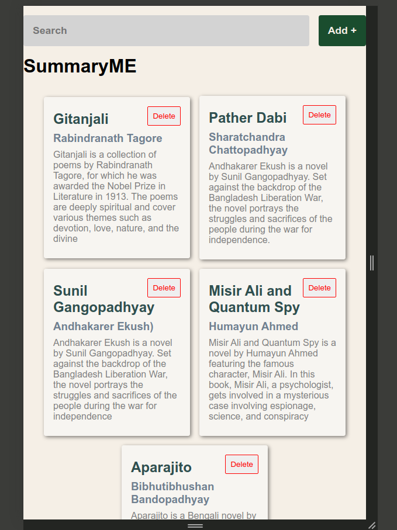
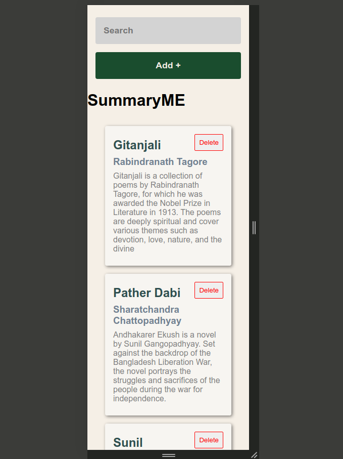

# SummaryME

SummaryME is a simple web application where users can create, summarize, and manage their book collection. Users can add new books with their titles and authors, delete existing book summaries, and search for books based on their titles or authors. The application provides a clean user experience with a responsive design.

## Tech Stack

- HTML
- CSS
- JavaScript

## Features

- Add new book summaries with title and author
- Delete existing book summaries
- Search for books by title or author

## Demo






## Installation

1. Clone the repository:

   ```bash
   git clone https://github.com/debrajroyofficial000/SummaryME.git
   ```

## Preview

[Link](https://6638e8928807c0e9b1abd7e1--summaryme.netlify.app/)
